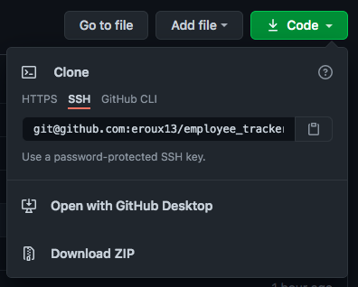
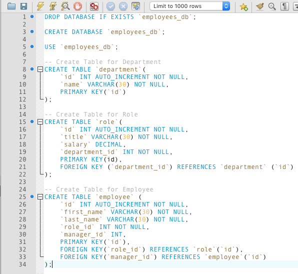
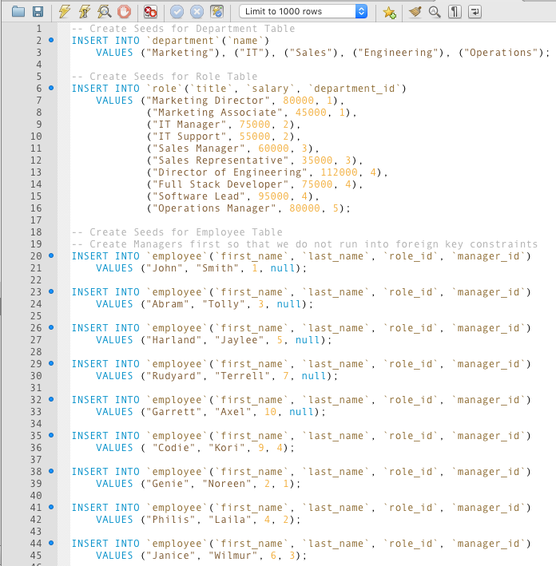
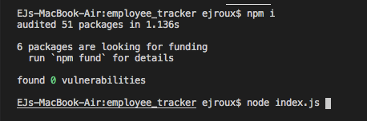

# Employee Tracker

## Description

This project is a CLI application that allows a company to build and maintain their employee database. It allows a user to view all employees, roles, as well as departments. It also allows for adding employees, roles, departments and updating employees all from your CLI. The project features the usage of [Node.js](https://nodejs.org/en/docs/), [Inquirer](https://www.npmjs.com/package/inquirer), and [MySQL](https://dev.mysql.com/doc/).

[Full Video Walkthrough](https://drive.google.com/file/d/1X_F14SLiFwuBMCfb5tmoI0cUtIF5Sd1X/view)

## Table of Contents

* [Description](#description)
* [License](#license)
* [Installation](#installation)
* [Usage](#usage)
* [Contributors](#contributors)
* [Tests](#tests)
* [Questions](#questions)
    
## License

License chosen: MIT.
More information about the license chosen can be found on [Open Source Initiative](https://opensource.org/licenses/MIT).
    
## Installation

To install this project, the user needs to clone the repository onto their local machine. 

From there, the user needs to create the database within [MySQL Workbench](https://www.mysql.com/products/workbench/) by running the `schema.sql` file. 

Once the databse has been created, the user can run the `seeds.sql` file to pre-populate the database. 

Once the database has been populated, the user needs to navigate into the project directory and run `npm i` in either Terminal or Git Bash depending on the user's OS, to install the required dependencies. There is also the option of running it in the integrated terminal in VS Code. To start the application the user then needs to run `node index.js`.

## Usage

This project was developed to create a Content Management System (CMS) interface that makes it easier for non-developers to view and interact with information stored in databases.

## Future Development

Some features that will be added in the future include:
- `UPDATE EMPLOYEE MANAGER`
- `VIEW EMPLOYEE BY MANAGER`
- `VIEW EMPLOYEE BY DEPARTMENT`
- `VIEW TOTAL BUDGET OF DEPARTMENT`
- `DELETE DEPARTMENT`
- `DELETE ROLE`
- `DELETE EMPLOYEE`

## Contributors

[eroux13](https://www.github.com/eroux13)

## Tests

A user can test the queries to make sure they return the proper values by running some of the test queries in the `queries.sql` file in MySQL Workbench.

## Questions

Feel free to follow my GitHub [profile](https://www.github.com/eroux13).
If you have any questions about this project, please reach out to me via ej.roux13@gmail.com.